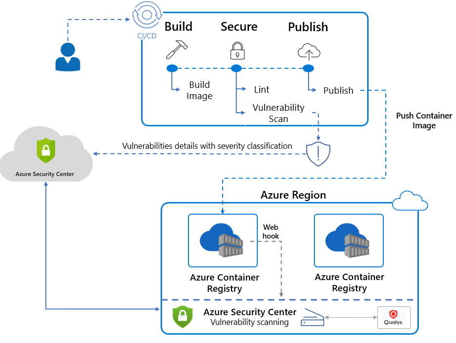

# Azure Cloud Defender CI/CD Integration Demo

## Overview
This repository contains an example Dockerfile and a GitHub actions workflow that can publish Container vulnerability results to Azure's Cloud defender. This functionality is part of the new Cloud Defenders CI/CD integration and is in preview. The Dockerfile produces an image that has several `high` vulnerabilities. 

For more information on this preview feature: [Click Here](https://docs.microsoft.com/en-us/azure/security-center/defender-for-container-registries-cicd)

## How it works
This repository leverages the amazing work done on `container-scan` github action. For information on this GitHub action please browse to: https://github.com/Azure/container-scan. 

At a high level this functionality works by levering Trivy (container vulnerability scanner) and Dockle (container linter). Both of these tools scan the docker image build that is built and the results are published to an Azure application insights instance. This data is then available in the Cloud Defender portal. 

### Findings 
Below are the findings that are generated:
#### GitHub Actions Example

#### Cloud Defender Example

### Architecture Overview
`Caution: This diagram is not official and is for example purposes only` 

## Requirements
1. An Azure Subscription
2. An Azure Container Registry
3. Cloud Defender for ACR configured (additional costs will be incurred)
4. Cloud Defenders CI/CD integration must be enabled
5. GitHub actions. 
## Trivy

The container scanning is performed by Trivy. Trivy is an open-source container vulnerability scanning tool that was donated by AquaSec.

For more information on Trivy: [Click Here](https://github.com/aquasecurity/trivy) 

## Disclaimer
The work contained in this repository is for demonstration purposes only. This work does not represent Microsoft in anyway. 
